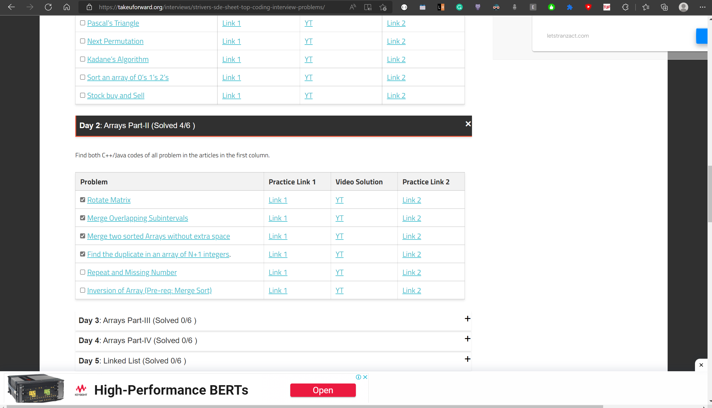

# Take U Forward SDE Sheet Checklist

Just a simple script that allows you to mark your done questions on the famous Striver's SDE sheet published at <a href="https://takeuforward.org/interviews/strivers-sde-sheet-top-coding-interview-problems/">https://takeuforward.org/interviews/strivers-sde-sheet-top-coding-interview-problems/</a>.

Read [this](https://webkul.com/blog/how-to-install-the-unpacked-extension-in-chrome/) to learn how to install an unpacked extension. You can download the zip folder from github repo (the big green button) and then unzip it to get the extension code.

NOTE: I will constantly modify this extension to make it more useful for me and since this is not backed by any database, some changes might not be backwards compatible and users (including me) might loose their marked progress 🥲. So use this extension at your own discretion.

Also since this is not published on the official chrome web store, you will have to manually update this extension by downloading this zip folder again and installing it just like the first time.

Disclaimer : I am not affiliated to the Take U Forward brand, nor is this extension offered by them. This is a personal project and I don't claim any ownership over the website content in any way.

P.S. : I made this extension so I don't have to do [this](./dont-do-this/sde-sheet.pdf) anymore 🙊 . Thanks [Raj Vikramaditya](https://www.linkedin.com/in/rajarvp/) for this amazing resource that has helped thousands of people like me.

If you want to connect, feel free to reach out on [linkedin](https://www.linkedin.com/in/vc2001/).

You can also follow me on [Leetcode](https://leetcode.com/vaibhavchopra/) and [Codeforces](https://codeforces.com/profile/creamyCockroach)
